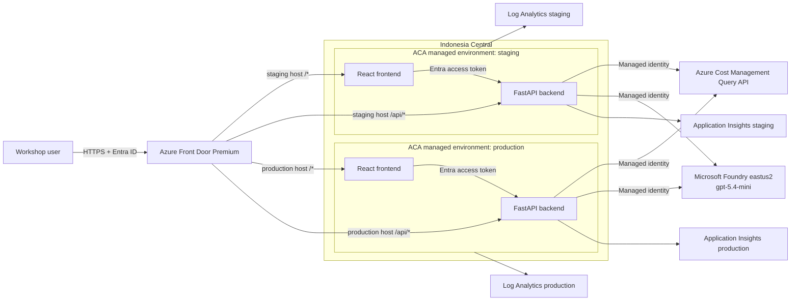
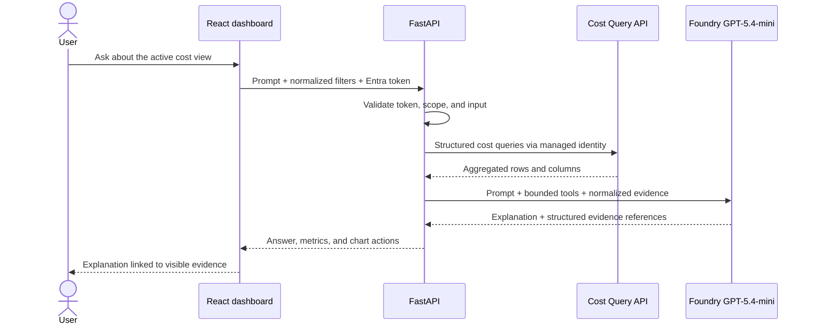
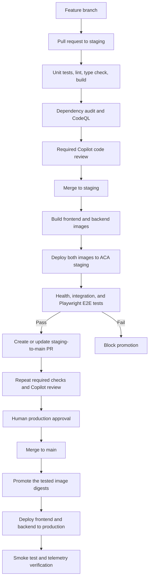

# Azure Cost Copilot Workshop Design

## Summary

Azure Cost Copilot is a production-like workshop application hosted in
`ibranibeny/GithubDay`. It combines an analytics-first Azure cost dashboard with
an AI chat panel that explains live subscription costs using the Azure Cost
Management Query API and Microsoft Foundry `gpt-5.4-mini`.

The workshop demonstrates application development, keyless Azure access,
observability, GitHub governance, and staged delivery. All application platform
resources are provisioned by idempotent Azure CLI scripts executed through
GitHub Actions. The existing Foundry deployment is reused to avoid model quota
being a workshop blocker.

## Confirmed Decisions

| Area | Decision |
| --- | --- |
| Repository | `ibranibeny/GithubDay` |
| Application stack | React + TypeScript frontend; Python FastAPI backend |
| Cost data | Live Azure data only; no mock fallback |
| Cost scope | Subscription `439cf6ec-8907-40ee-bae2-7efd9656cd09` |
| Subscription name | `ME-MngEnvMCAP708029-benyibrani-1` |
| Subscription tenant | `a1571616-cb5c-4d81-93ab-83c3856d83f2` |
| ACA region | `indonesiacentral` |
| Foundry region | `eastus2` |
| Foundry resource | `lab-ai-demo/aisdgkwm01` |
| Model deployment | `gpt-5.4-mini` |
| Edge | Azure Front Door Premium without WAF |
| Environments | Separate staging and production ACA managed environments |
| Container Apps | Four total: frontend and backend in each environment |
| Observability | Separate Log Analytics and Application Insights per environment |
| Infrastructure | Idempotent Azure CLI scripts, executed through GitHub Actions |
| Authentication | Microsoft Entra ID for users; managed identity for workloads |
| UI direction | Analytics-first dashboard with contextual chat panel |

## Runtime Architecture

Azure Front Door Premium is required because Private Link to Container Apps
origins is not supported by the Standard tier. No WAF policy is attached. Front
Door routes `/api/*` to the environment's backend and all other paths to its
frontend. Public network access on both ACA managed environments is disabled.

Staging and production use distinct Front Door hostnames. Both require Entra
authentication, and staging access is limited to the workshop participant group.

## Identity and Access

The design separates user identity, runtime identity, and deployment identity.

### User Identity

The React application uses MSAL to sign users in with Microsoft Entra ID. It
requests an access token for the backend API. FastAPI validates issuer, audience,
signature, expiry, and group or app-role claims. A user can only request the
configured workshop subscription; arbitrary Azure scope IDs are rejected.

### Runtime Identity

Each backend Container App uses a managed identity and `DefaultAzureCredential`.
The same code uses the developer's Azure CLI session locally and managed identity
in ACA.

Minimum runtime roles:

| Scope | Role | Purpose |
| --- | --- | --- |
| Workshop subscription | Cost Management Reader | Query cost and forecast data |
| Existing Foundry resource | Cognitive Services OpenAI User | Run model inference |
| Azure Container Registry | AcrPull | Pull signed application images |

Frontend Container Apps do not receive Cost Management or Foundry roles.

### Deployment Identity

GitHub Actions authenticates through OIDC workload identity federation. Staging
and production use separate user-assigned managed identities and federated
credentials. The production identity is scoped only to production resources.
No client secret, Foundry key, ACR password, or publish profile is stored in
GitHub.

## Application Components

### Frontend

The React frontend is an operational FinOps workspace, not a landing page. Its
primary screen contains:

- Scope, date range, actual/amortized cost, and grouping controls.
- Month-to-date cost, forecast, period change, and top-driver KPIs.
- Daily stacked cost and forecast chart.
- Cost breakdown by service, resource group, resource, and tag.
- Drill-down table with sorting and filtering.
- Contextual chat panel that inherits the active dashboard filters.
- Evidence links in AI answers that update or highlight the relevant chart.

The visual direction follows Azure Cost Analysis information density while using
an original implementation. WebIQ image search identified Microsoft Learn's Cost
Analysis screenshots as the primary visual reference. The application renders
its own charts from API data and does not bundle those screenshots.

### Backend

FastAPI owns authentication, Azure API calls, schema validation, cost data
normalization, and model orchestration. The LLM never constructs arbitrary ARM
URLs. It can only invoke registered tools with validated schemas and bounded date
ranges.

Initial API surface:

| Method | Path | Purpose |
| --- | --- | --- |
| GET | `/api/costs/summary` | KPI totals, comparison, and forecast |
| GET | `/api/costs/trend` | Daily cost series and forecast |
| GET | `/api/costs/breakdown` | Grouped cost dimensions and top items |
| POST | `/api/chat` | Evidence-grounded analysis with active filters |
| GET | `/health/live` | Process liveness |
| GET | `/health/ready` | Runtime dependency readiness |

The dashboard uses the Cost Management Query API because it supports grouping,
filtering, and aggregation. Cost Details and Exports are outside the first
workshop scope because they target bulk or asynchronous ingestion.

### Chat Processing

If cost data cannot be retrieved, the model is not called and the API returns a
specific error. The application never substitutes an ungrounded answer.

## GitHub Flow and CI/CD

Planned workflows:

| Workflow | Trigger | Responsibility |
| --- | --- | --- |
| `ci.yml` | PR to `staging` or `main` | Test, lint, type check, build, dependency audit |
| `codeql.yml` | PR and protected branches | CodeQL for Python and JavaScript/TypeScript |
| `infra.yml` | Manual dispatch with approval | Run idempotent Azure CLI provisioning scripts |
| `deploy-staging.yml` | Push to `staging` | Build, push, deploy, and test both apps |
| `promote.yml` | Successful staging deployment | Create or update PR from `staging` to `main` |
| `deploy-production.yml` | Push to `main` | Promote tested digests and deploy production |

The production workflow does not rebuild images. It deploys the immutable image
digests that passed staging tests.

Repository rulesets require pull requests, block force pushes and deletions,
require CodeQL results at high-or-higher severity, and automatically request a
Copilot review. Required status checks are attached after the workflows have run
once and their check names exist. The `production` GitHub Environment requires a
human approver and only permits the `main` branch.

## Azure CLI Infrastructure

The infrastructure implementation uses Azure CLI scripts only, as requested.
Scripts must be idempotent and safe to rerun. Each script uses explicit
subscription, tenant, resource group, and region parameters; checks current state
before mutation; and fails on partial configuration.

Planned script responsibilities:

- `bootstrap-oidc`: create or validate deployment identities, federated
  credentials, and least-privilege role assignments.
- `provision-shared`: create ACR and Front Door Premium.
- `provision-environment`: create environment-specific resource group, VNet,
  ACA managed environment, Log Analytics, Application Insights, identities, and
  Container Apps.
- `configure-frontdoor`: configure private origins, routes, probes, and approve
  private endpoint connections.
- `deploy`: publish a supplied frontend and backend image digest to ACA.
- `verify`: query health, revision, route, identity, diagnostic setting, and
  telemetry state.

The scripts use predictable tags for owner, workshop, environment, repository,
and cost center. Resource names are parameterized to avoid collisions.

## Observability

Staging and production each receive a dedicated Log Analytics workspace and a
workspace-based Application Insights resource.

FastAPI uses Azure Monitor OpenTelemetry for:

- Incoming request traces, status, and latency.
- ARM Cost Management and Foundry dependency calls.
- Exceptions and retry outcomes.
- Cost-query duration, row count, and throttling metrics.
- Model deployment, duration, and token usage metrics.

React emits page views, route transitions, failed API calls, and Web Vitals.
Prompt text, model answers, access tokens, raw cost payloads, and resource IDs are
not logged. A correlation ID flows from browser to API and dependency telemetry.

ACA and Front Door diagnostic settings send platform logs and metrics to the
matching Log Analytics workspace. Initial alerts cover backend error rate, P95
latency, failed dependencies, ACA replica restarts, and missing post-deployment
telemetry.

## Error Handling

| Condition | Behavior |
| --- | --- |
| Invalid or expired user token | Return `401`; prompt reauthentication |
| User outside workshop group | Return `403`; do not call Azure APIs |
| Managed identity lacks cost role | Return actionable `403` with scope guidance |
| Cost data delayed or rerated | Display freshness and current-period caveat |
| ARM or Foundry throttling | Respect retry headers and use bounded backoff |
| Foundry timeout | Preserve cost evidence and report AI explanation unavailable |
| Cost query failure | Do not call the model or invent an answer |
| Invalid dimension/date range | Return validation details without ARM call |

## Testing Strategy

### Pull Request Tests

- Frontend unit tests for filters, chart transforms, auth state, and evidence
  actions.
- Backend unit tests for query builders, tool schemas, authorization mapping,
  and telemetry sanitization.
- Sanitized contract fixtures for Azure API response shapes.
- Lint, type checks, production builds, dependency audit, and CodeQL.

### Staging Tests

- Health and readiness checks for both Container Apps.
- Integration tests against live Cost Management and Foundry using managed
  identity.
- Playwright E2E for Entra login, dashboard filtering, chat, and evidence links.
- Front Door route and Private Link validation.
- Application Insights ingestion check before promotion.

### Production Tests

- Non-destructive health and route smoke tests.
- Active revision and immutable image digest verification.
- Application Insights telemetry arrival check.

Any staging test failure prevents creation or update of the promotion PR.

## Scope Exclusions

- No mock cost-data fallback.
- No persistent database or chat history.
- No Azure Cost Management write operations.
- No automatic remediation of Azure resources.
- No WAF policy.
- No bulk Cost Details or Exports ingestion in the initial workshop.
- No creation of a new Foundry resource or model deployment.

## Acceptance Criteria

1. An authorized workshop user can sign in and view live cost data for the
   configured subscription.
2. Dashboard filters produce matching totals, trend series, and breakdowns.
3. Chat answers are grounded in queried evidence and can update the chart view.
4. Staging and production run in separate ACA managed environments with separate
   frontend and backend apps.
5. Backend calls Cost Management and Foundry without stored credentials.
6. Front Door Premium reaches private ACA origins without a WAF policy.
7. Azure Monitor and Application Insights receive application and platform
   telemetry in both environments.
8. A feature cannot reach `staging` without required tests, CodeQL, and Copilot
   review.
9. A staging build cannot open a promotion PR until live staging tests pass.
10. Production deploys the same image digests tested in staging after approval.
11. Infrastructure can be provisioned or reconciled by rerunning GitHub Actions
    Azure CLI workflows.

## Risks and Mitigations

| Risk | Mitigation |
| --- | --- |
| Azure MCP is authenticated to a different tenant | Provision through Azure CLI/OIDC explicitly scoped to the lab tenant |
| Shared Foundry model quota is exhausted | Preflight quota and deployment availability before workshop; fail clearly |
| Indonesia Central to East US 2 adds model latency | Stream responses, expose dependency latency, and set explicit timeouts |
| No WAF increases edge exposure | Require Entra authentication, private origins, strict validation, and app rate limiting |
| Azure CLI scripts drift from actual state | Use idempotent checks, explicit outputs, verification scripts, and CI review |
| Current-period cost can change after retrieval | Show data freshness and rerating notice in the UI |

## Research References

Official Microsoft sources:

- [Cost Management automation scenarios](https://learn.microsoft.com/azure/cost-management-billing/manage/cost-management-automation-scenarios)
- [Cost Management REST API](https://learn.microsoft.com/rest/api/cost-management/)
- [Assign access to Cost Management data](https://learn.microsoft.com/azure/cost-management-billing/costs/assign-access-acm-data)
- [Generate responses with Microsoft Foundry Models](https://learn.microsoft.com/azure/foundry/foundry-models/how-to/generate-responses)
- [Foundry authentication with Microsoft Entra ID](https://learn.microsoft.com/dotnet/ai/azure-ai-services-authentication)
- [Foundry model regional availability](https://learn.microsoft.com/azure/foundry/foundry-models/concepts/models-sold-directly-by-azure-region-availability)
- [Front Door Premium with ACA and Private Link](https://learn.microsoft.com/azure/container-apps/front-door-custom-virtual-network-private-link)
- [Deploy to Container Apps with GitHub Actions](https://learn.microsoft.com/azure/container-apps/github-actions)
- [Cost Analysis quickstart](https://learn.microsoft.com/azure/cost-management-billing/costs/quick-acm-cost-analysis)

WebIQ visual research:

- [Microsoft Azure FinOps solution](https://azure.microsoft.com/solutions/finops)
- [Microsoft Learn accumulated cost view](https://learn.microsoft.com/azure/cost-management-billing/costs/quick-acm-cost-analysis)
- [FinOps toolkit cost summary](https://learn.microsoft.com/cloud-computing/finops/toolkit/power-bi/cost-summary)